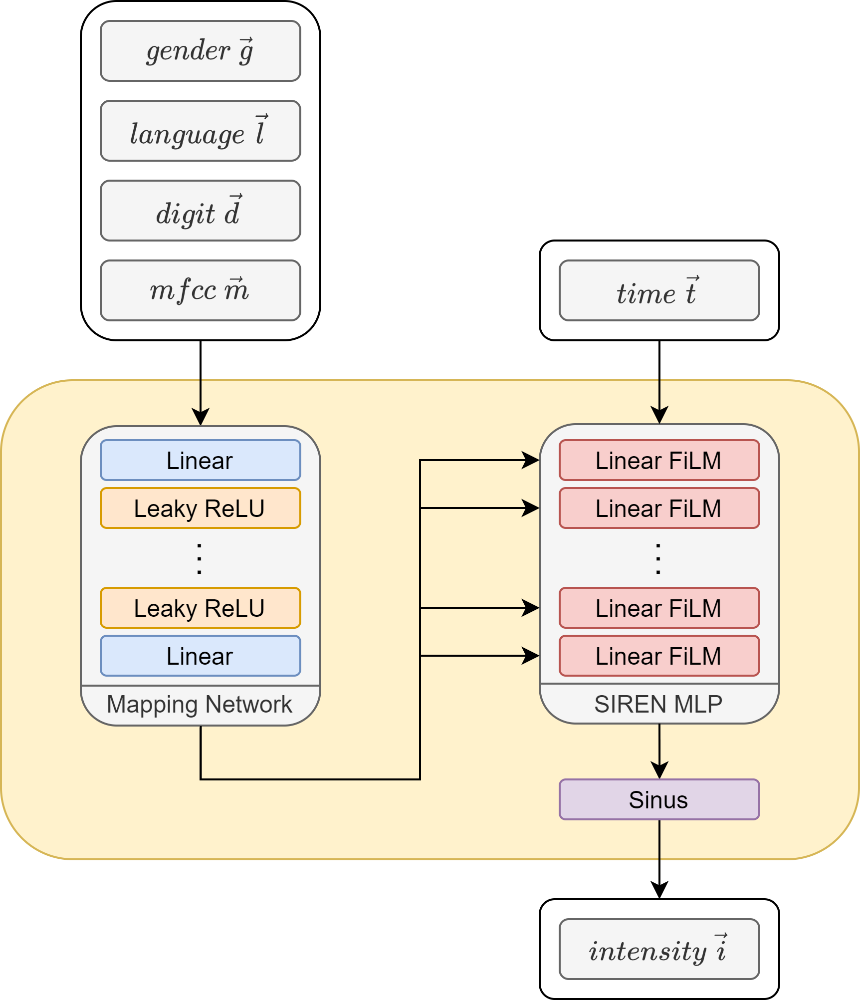

[⬅️ Overview](../README.md)
[⬅️ Preprocessing](./preprocessing.md)

# Concepts and architectures

We evaluated different concepts and architectures to analyze and generate audio data. The following list contains the concepts and architectures we tried.

- Siren (trained on raw signal, ouputs raw signal)
- Siren (trained on mel spectrogram, outputs mel spectrogram)
- GAN (trained on mel spectogram, outputs mel spectrogram)

In this part of the documentation, the considered network architectures are presented and further discussed.

## Siren (raw signal)

The first concept was to use the raw signal as a base for the audio data. The Siren architecture [[3]](./references.md#papers-siren) enables to train a neural network on raw signal data (i.e. sample intensity at given times) and finally predict a signal for given a time in a signal. Additionally, a mapping layer (FilM [[2]](./references.md#papers-film)) creates an association between the data and the metadata. This association is then used in the actual Siren alongside the position (time of sample) to generate an intensity, given metadata and temporal positions.

<figure>
  
  <figcaption>Fig. 3: High level architecture of Siren signal generator(based on TODO)</figcaption>
</figure>

## Siren (Mel spectrogram)

The second concept was to use the Siren architecture but with images displaying Mel spectrograms of the audio files as the base for generation. The idea is to train the model with image data for it to associate image coordinates x and y with a color value p. The model is then able to predict a color value for every coordinate of an image, resulting in a generated spectrogram. Finally, the spectrogram is then converted to a signal using the inverse Mel spectrogram transformation.

<figure>
  
  <figcaption>Fig. 4: High level architecture of Siren Mel generator (based on TODO)</figcaption>
</figure>

[Fig. 5](#figures-siren-mel-process) shows the development of a model training from epoch 0 to 50 using the Siren Mel model. It is visible how the quality of the generated image increases from a blurry spectrogram to a more clear one.

<figure>
  
  <figcaption>Fig. 5: Development of an training attempt of a single language, single gender, 2 digit generator in 50 epochs</figcaption>
</figure>

The following table demonstrates some audio files generated by the Siren Mel model. The metadata is displayed in the table header. The audio files are generated using the metadata and the generated spectrogram.

| model                                | generated audio                                                                                          | metadata                         |
| ------------------------------------ | -------------------------------------------------------------------------------------------------------- | -------------------------------- |
| Model trained on 2 speakers, 1 digit | <audio controls><source src="./2-speakers-1-digits-lang-english-sex-female-digit-0-mfcc-0.wav"/></audio> | female, english, digit 0, mfcc 0 |
| Model trained on 2 speakers, 1 digit | <audio controls><source src="./2-speakers-1-digits-lang-english-sex-female-digit-0-mfcc-1.wav"/></audio> | female, english, digit 0, mfcc 1 |
| Model trained on 1 speaker, 2 digits | <audio controls><source src="./1-speakers-2-digits-lang-english-sex-female-digit-0-mfcc-0.wav"/></audio> | female, english, digit 1, mfcc 0 |

Table 1: Examples of generated audio using mel spectrograms in siren

[➡️ Development and usage](./development-and-usage.md)
