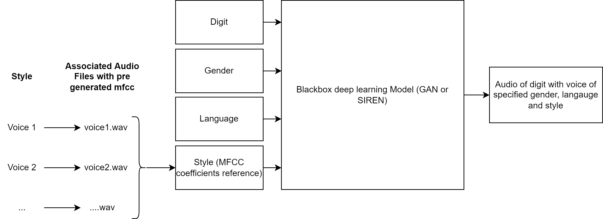

[⬅️ Overview](../README.md)

## Metadata

The generator is expected to generate an audio from the following metadata (i.e. features):

- digit
- language (English, German)
- gender (male, female)
- style.

Given some metadata, the neural network should be able to generate a fitting audio file. [Fig. 1](#interface) shows the interface of the model with its input and output.

<figure>
  
  <figcaption>Fig. 1: Interface of the digit generator</figcaption>
</figure>

 

A particularity is the selection of the style. Since it is difficult to capture a speaking style objectively, mfcc coefficients (hereafter referred to as "mfcc's") are used as a substitute. Although mfcc's are a valid input for neural network processing, consumers would not know which mfcc's to provide. Therefore, some reference files containing pre-generated mfcc's are provided. These reference mfcc's can then be used as input for inference.

[➡️ Dataset](./dataset.md)
