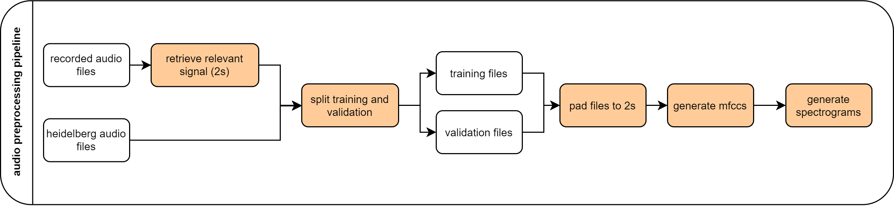

[⬅️ Overview](../README.md)
[⬅️ Dataset](./dataset.md)

# Preprocessing

In order to prepare all the data for the training, a set of functions merged into a preprocessing script ([preprocessing.py](../preprocessing.py)) is included in this project. The preprocessing is split into 5 phases, with the first one only being relevant for the first execution.

<figure>
  
  <figcaption>Fig. 2: Preprocessing of audio files for training and validation</figcaption>
</figure>

1. Split audio of 60 seconds ([split_audio_signals.py](../data_handling/preprocessing/split_audio_signals.py))

   In this optional phase, the recorded audio files are analyzed and split into 2 seconds long snippets. This is used for the newly recorded audio files.

2. Split training / validation data ([train_val_split.py](../data_handling/preprocessing/train_val_split.py))

   For training purposes, the data is split into training and validation sets. This is done for each combination of speaker, language and digit where the count of trials is used for the file count. The trial count is multiplied with a split factor (0-1) to control how many validation files should be used for validation.

   Here's an example: Given a `split factor` of `0.1` and a dataset which contains `10 trials` of `speaker 1` in `language English` for `digit 0`, there will be `10*0.1=1` validation and `10-1=9` training files for `speaker 1, language English, digit 0`.

3. Generate mfcc's ([mfcc.py](../data_handling/preprocessing/mfcc.py))

   As mfcc's are another feature that the model is trained on, it is good practice to pre-generate them for training. To generate mfcc's, `librosa` provides a function `librosa.feature.mfcc`. For each file 50 mfcc coefficients are generated from the whole signal (meaning `hop length = signal length + 1`) and used for training.

4. Generate spectrograms ([spectrogram.py](../data_handling/preprocessing/spectrogram.py))

   For models that are trained using spectrograms, Mel Spectrograms are generated for each audio. `librosa` provides a function `librosa.feature.melspectrogram` to generate a Mel Spectrogram from a signal. The function returns a 1 channel gray scale image per default, which are saved to disk for training.

5. Pad audio to 2 seconds ([pad.py](../data_handling/preprocessing/pad.py))

   Some of the heidelberg data might be shorter than 2 seconds. To make sure that all audio files are of the same length, they are padded with zeros to 2 seconds.

[➡️ Concepts and architectures](./concepts-and-architectures.md)
