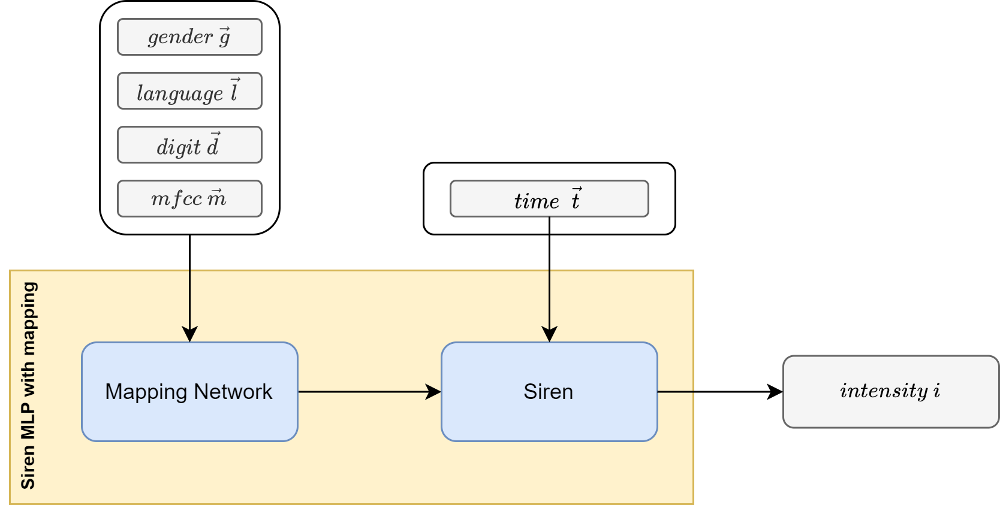
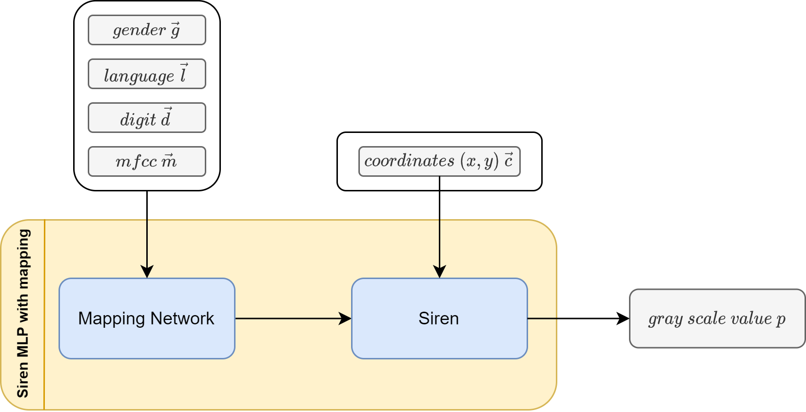
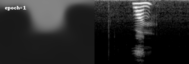

[⬅️ Overview](../README.md)
[⬅️ Preprocessing](./preprocessing.md)

# Concepts and architectures

We evaluated different concepts and architectures to analyze and generate audio data. The following list contains the concepts and architectures we tried.

- Siren (trained on raw signal, ouputs raw signal)
- Siren (trained on mel spectrogram, outputs mel spectrogram)
- GAN (trained on mel spectogram, outputs mel spectrogram)

The architectures are further explained in the [model](./model/README.md) subpage.

In this part of the documentation, the considered network architectures are presented and further discussed.

## Siren (raw signal)

The first concept was to use the raw signal as a base for the audio data. The Siren architecture enables to train a neural network on raw signal data (i.e. sample amplitudes at given times) and finally predict a signal for given a time in a signal. Additionally, a mapping layer (FiLm) based on the metadata and additionally the position. We were hoping for the neural network to associate the metadata with the position and value of the samples.

<figure>
  
  <figcaption>Fig. 3: High level architecture of Siren signal generator(based on TODO)</figcaption>
</figure>

## Siren (Mel spectrogram)

The second concept was to use the Siren architecture but with images displaying Mel spectrograms of the audio files as the base for generation.

<figure>
  
  <figcaption>Fig. 4: High level architecture of Siren Mel generator (based on TODO)</figcaption>
</figure>
<figure>
  
  <figcaption>Fig. 5: Development of an training attempt of a single language, single gender, 2 digit generator in 50 epochs</figcaption>
</figure>

## GAN (mel spectrogram)

[➡️ Development and usage](./development-and-usage.md)
